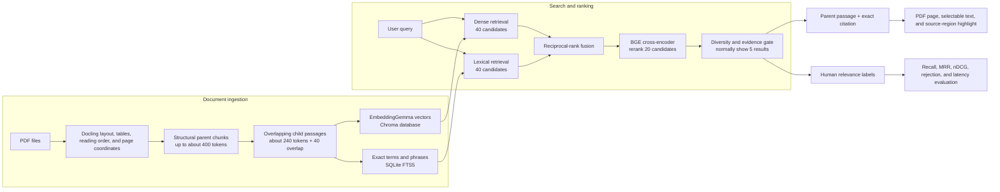

# Reference Desk

Reference Desk is a private, local search application for PDF collections. It
finds relevant passages across all your documents and opens the exact page and
highlighted source region.

Your PDFs, indexes, bookmarks, and notes stay on your computer. They are not
uploaded to GitHub.

## What it can do

- Search all indexed PDFs at once.
- Combine semantic and exact-term search, then rerank the best passages.
- Open citations on the correct PDF page with selectable text.
- Save passages, notes, bookmarks, and named research collections.
- Compare passages and export selected material to Markdown or Word.
- Add, replace, quarantine, restore, and back up documents from the interface.
- Check corpus health, storage use, duplicates, and document revisions.

## Computer requirements

The recommended computer has:

- Windows 10 or Windows 11.
- Python 3.12, 64-bit.
- Ollama.
- An NVIDIA CUDA or AMD ROCm-compatible GPU with at least 8 GB VRAM.
- A current GPU driver.

CPU mode is available, but document processing and reranking will be much
slower. Node.js is not required unless you plan to change the interface.

## First-time installation on Windows

### 1. Install the prerequisites

Install these applications before continuing:

1. [Python for Windows](https://www.python.org/downloads/windows/) — choose a
   64-bit Python 3.12 release and enable **Add Python to PATH** during setup.
2. [Git for Windows](https://git-scm.com/download/win).
3. [GitHub CLI](https://cli.github.com/).
4. [Ollama for Windows](https://ollama.com/download/windows).
5. The latest driver for your NVIDIA or AMD GPU.

Git and GitHub CLI can also be installed from PowerShell with Windows Package
Manager:

```powershell
winget install --id Git.Git -e
winget install --id GitHub.cli -e
```

Close and reopen PowerShell after installing them.

### 2. Download Reference Desk with GitHub CLI

Open PowerShell and run:

```powershell
gh auth login --web --git-protocol https
cd "$HOME\Documents"
gh repo clone FKENZOLS/reference-desk
cd reference-desk
```

The first command opens GitHub in your browser. Complete the sign-in and return
to PowerShell when it finishes.

### 3. Run the automatic setup

```powershell
powershell -ExecutionPolicy Bypass -File .\scripts\setup.ps1 -Backend auto
```

The setup creates an isolated Python environment, detects NVIDIA CUDA or AMD
ROCm, installs the correct packages, downloads EmbeddingGemma through Ollama,
and checks the GPU. The first installation is several gigabytes and can take a
while.

If automatic detection selects the wrong backend, replace `auto` with one of:

```powershell
# AMD GPU
powershell -ExecutionPolicy Bypass -File .\scripts\setup.ps1 -Backend rocm

# NVIDIA GPU
powershell -ExecutionPolicy Bypass -File .\scripts\setup.ps1 -Backend cuda

# Slow compatibility mode
powershell -ExecutionPolicy Bypass -File .\scripts\setup.ps1 -Backend cpu
```

### 4. Start the application

```powershell
powershell -ExecutionPolicy Bypass -File .\start.ps1
```

Reference Desk normally opens automatically. If it does not, visit
[http://127.0.0.1:7860](http://127.0.0.1:7860).

Keep the PowerShell window open while using the app. Press `Ctrl+C` in that
window to stop it.

## Add and search documents

1. Open **Documents** in the left navigation.
2. Add one or more PDF files.
3. Select **Apply pending changes**.
4. Wait for indexing to finish.
5. Return to **Search** and search the whole collection.

Large or scanned documents can take longer. The ingestion queue can be paused
between documents, and a failed PDF is moved to quarantine instead of stopping
the rest of the queue.

## Update to the latest version

Open PowerShell in the `reference-desk` folder and run:

```powershell
git pull --ff-only
powershell -ExecutionPolicy Bypass -File .\scripts\setup.ps1 -Backend auto
```

The setup command reuses packages that are already installed. Start the app
again with `powershell -ExecutionPolicy Bypass -File .\start.ps1`.

## Move your library to another computer

GitHub contains only the application. Your PDFs and research data are separate.

1. In the old installation, open **Documents** and select **Create backup**.
2. Install Reference Desk on the new computer using the instructions above.
3. Open **Documents** on the new computer and restore the backup.

See [GITHUB_TRANSFER.md](GITHUB_TRANSFER.md) for the shorter transfer checklist.

## Troubleshooting

### `python` is not recognized

Install 64-bit Python 3.12 again, enable **Add Python to PATH**, and reopen
PowerShell.

### `gh` or `git` is not recognized

Install Git and GitHub CLI, then close and reopen PowerShell. Confirm the setup
with:

```powershell
git --version
gh --version
```

### PowerShell says script execution is disabled

Use the full commands shown in this README. They run the scripts with
`-ExecutionPolicy Bypass` only for that process and do not permanently change
your Windows policy.

### Ollama is unavailable or EmbeddingGemma is missing

Start the Ollama application, then run:

```powershell
ollama pull embeddinggemma
```

### AMD ROCm setup fails

Update the AMD driver and confirm that the GPU is supported by AMD's current
PyTorch-on-Windows release. Ollama supporting a GPU through Vulkan does not
automatically mean that PyTorch supports the same GPU through ROCm. CPU mode is
available as a fallback.

### The app reports insufficient GPU memory

The supported target is at least 8 GB VRAM. Close other GPU-heavy applications
and retry. The document manager automatically releases search models before
starting ingestion.

### Check the installation

```powershell
.\.venv\Scripts\python.exe main.py doctor
```

## Privacy and backups

The following data stays local and is excluded from GitHub:

- Source PDFs.
- Chroma and lexical indexes.
- Notes, bookmarks, search history, and quality labels.
- Quarantine, revisions, logs, and corpus backups.

Use **Create backup** in the Documents page to move or protect this data.

<details>
<summary>Linux installation</summary>

Install Python 3.12, Git, Ollama, and the correct NVIDIA or AMD driver. Then run:

```bash
gh auth login --web --git-protocol https
gh repo clone FKENZOLS/reference-desk
cd reference-desk
bash scripts/setup.sh auto
bash start.sh
```

</details>

## Advanced: architecture and retrieval quality

Reference Desk uses retrieval rather than answer generation. It returns source
passages and keeps a direct route back to the PDF evidence.



### Parent–child retrieval

Docling first reconstructs document structure: headings, paragraphs, lists,
tables, reading order, page numbers, and source coordinates. The chunker then
creates two related representations:

- A **parent chunk** keeps the section context and is what the user reads.
- Smaller overlapping **child passages** are embedded and searched.

Small children make precise matches easier, while the parent prevents an
isolated sentence from losing its heading or surrounding explanation. Every
child stores its parent identity and provenance, so a match can expand back to
the readable passage and exact PDF region.

### Hybrid retrieval and reciprocal-rank fusion

Each query runs through two independent retrieval lanes:

1. **Dense retrieval** compares the EmbeddingGemma query vector with child
   vectors in Chroma. It handles paraphrases and related meaning.
2. **Lexical retrieval** uses SQLite FTS5 for exact words, phrases, acronyms,
   identifiers, and numbers.

The two score types are not directly comparable. Reciprocal-rank fusion (RRF)
therefore combines their positions instead of their raw scores:

`RRF(document) = sum of 1 / (60 + rank in each result list)`

A passage found by both lanes rises naturally, while a strong result from only
one lane can still survive. By default, each lane retrieves 40 candidates and
the fused list keeps 20 for reranking.

### Cross-encoder reranking and result diversity

`BAAI/bge-reranker-v2-m3` reads the query and each shortlisted passage together.
This is more accurate than vector similarity but more expensive, which is why
it runs only after retrieval has reduced the corpus to 20 candidates.

The final selector normally shows five results. It limits repeated passages
from the same page or section, then optionally applies a relevance threshold
learned from explicit user labels. The threshold remains inactive until there
are enough relevant and incorrect examples to calibrate it safely.

### What the quality metrics mean

- **Recall@k** asks whether a known relevant passage appears anywhere in the
  first `k` results. It reveals whether retrieval found the evidence at all.
- **MRR (Mean Reciprocal Rank)** looks only at the first relevant result. A
  first-place hit scores `1`, second place scores `1/2`, fifth place scores
  `1/5`, and the scores are averaged across queries. Higher MRR means useful
  evidence appears sooner.
- **nDCG@k** rewards placing all relevant results near the top and can give
  more credit to more-relevant passages. Its logarithmic discount makes a
  relevant result at rank 2 worth more than the same result at rank 10.
- **Rejection accuracy** checks whether the system correctly reports that no
  strong evidence was found for an unanswerable query.
- **Stage recall and latency** show where quality or speed was lost: dense
  retrieval, lexical retrieval, fusion, reranking, or final filtering.

The benchmark format stores expected source pages and passages. User feedback
can be exported into the same format, allowing changes to chunking, candidate
counts, fusion, or reranking to be compared against real reference tasks.

<details>
<summary>Developer commands</summary>

```powershell
python main.py serve
python main.py ingest
python main.py evaluate benchmark.starter.jsonl
python main.py doctor
python main.py export
python main.py test
```

The production React bundle is included in `frontend/dist`. Node.js 20 or newer
is needed only when modifying `frontend/src`. Read
[ARCHITECTURE.md](ARCHITECTURE.md) before reorganizing ingestion, retrieval,
citations, or storage.

</details>

## License

No open-source license has been selected yet. The repository is public for
viewing and personal installation; public availability alone does not grant
additional reuse rights.
