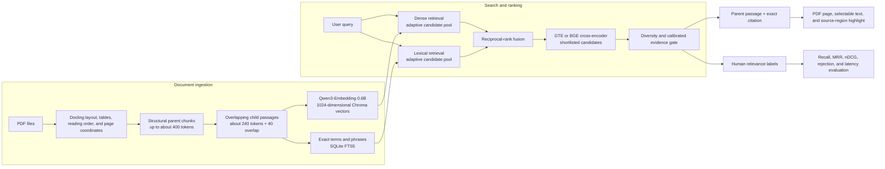

# Reference Desk

[](https://github.com/FKENZOLS/reference-desk/actions/workflows/tests.yml)
[](https://github.com/FKENZOLS/reference-desk/releases/latest)

[](LICENSE)

Reference Desk is a private, local search application for PDF libraries. Ask a
question, find the strongest passages across your documents, and open the exact
PDF page and highlighted source region.

It is intentionally **evidence-first**. Reference Desk retrieves and ranks
source passages; it does not generate an answer that could hide where a claim
came from.

Your PDFs, indexes, searches, notes, and quality labels stay on your computer.

## At a glance

- Hybrid semantic and exact-term search across a local PDF collection.
- Multilingual GTE reranking by default, with BGE available for comparison.
- Exact citations with page and source-region provenance.
- Structure-aware ingestion for headings, paragraphs, lists, tables,
  definitions, requirements, and equations.
- Saved passages, notes, collections, comparisons, and Markdown/Word export.
- Managed indexing queue with pause, recovery, quarantine, revisions, and
  portable backups.
- Built-in relevance labeling, benchmark management, experiments, regression
  thresholds, confidence intervals, and latency metrics.
- Isolated reranker process, automatic GPU-memory coordination, safe software
  updates, and privacy-safe diagnostic export.

## Quick start on Windows

No Git or programming experience is required.

### Requirements

| Required | Notes |
| --- | --- |
| Windows 10 or 11 | 64-bit installation |
| Python 3.12 | Enable **Add Python to PATH** during installation |
| Ollama | Runs the Qwen embedding model locally |
| Current GPU driver | NVIDIA CUDA and supported AMD ROCm devices are detected automatically |

A GPU is strongly recommended. CPU mode works, but document ingestion and
reranking are considerably slower. Six gigabytes of VRAM is usable; 8 GB or
more gives Docling and the reranker more headroom.

Node.js is required only when changing the React interface.

### Install

1. Install [64-bit Python 3.12](https://www.python.org/downloads/windows/) and
   [Ollama for Windows](https://ollama.com/download/windows).
2. Download `reference-desk-windows.zip` from the
   [latest release](https://github.com/FKENZOLS/reference-desk/releases/latest).
3. Extract the complete ZIP. Do not run the application from inside it.
4. Double-click `SETUP.bat` and wait for the success message.
5. Double-click `START.bat`.

The first setup creates an isolated Python environment, installs the appropriate
CUDA, ROCm, or CPU packages, downloads `qwen3-embedding:0.6b`, caches the
rerankers and tokenizer, and checks the installation. Several gigabytes may be
downloaded.

Reference Desk normally opens automatically. Otherwise visit
[http://127.0.0.1:7860](http://127.0.0.1:7860).

Keep the command window open while using the application. Close it or press
`Ctrl+C` to stop, then use `START.bat` the next time.

## Your first search

1. Open **Documents**.
2. Add one or more PDFs.
3. Select **Apply pending changes**.
4. Wait for indexing to finish.
5. Open **Search** and enter a question, phrase, identifier, or section number.
6. Select **Open source** on a result to inspect the original evidence.

Large technical books take time to index because pages are reconstructed,
tables are analyzed, passages are embedded, and provenance is preserved. The
queue continues when one PDF fails; an unrecoverable document is quarantined
instead of stopping every remaining item.

### Main areas

| Area | Purpose |
| --- | --- |
| **Search** | Query the collection, filter scope, switch rerankers, inspect citations, and label relevance |
| **Documents** | Upload, replace, reindex, restore, quarantine, back up, and inspect corpus health |
| **Workspace** | Organize saved passages, notes, and research collections |
| **Advanced → Quality** | Review labels and calibrate the relevance gate |
| **Advanced → Experiments** | Compare retrieval configurations on versioned benchmarks |
| **Advanced → Software updates** | Check and safely fast-forward a Git installation |

GTE loads in the background after startup. The application keeps only the
selected reranker active, limiting GPU-memory use. The first search after
switching rerankers can therefore take longer.

## Everyday operations

### Back up or move a library

1. Open **Documents** and select **Create backup**.
2. Install Reference Desk on the destination computer.
3. Open **Documents** there and restore the backup.

The backup includes the managed documents, indexes, queue state, revisions,
quarantine, and research workspace. GitHub contains only application source.

### Reclaim index storage

After deleting or repeatedly reindexing large documents, open **Documents** and
select **Optimize storage**. Reference Desk pauses search, creates a recovery
backup, rebuilds the dense index from active vectors, removes orphaned segment
and debug files, compacts the lexical databases, and verifies that manifest,
dense, and lexical passage counts still match. Apply any pending document
changes first. The recovery backup remains available until you delete it.

### Update the application

For a Git-based installation, open **Advanced → Software updates**. The updater:

- fetches the configured GitHub tracking branch;
- accepts only a clean, fast-forward update;
- refuses to overwrite local source changes or merge diverged history;
- preserves all ignored library and workspace data; and
- restarts automatically when the app was opened through `START.bat` or
  `start.ps1`.

For a ZIP installation, download the latest release again, extract it over the
application folder, run `SETUP.bat`, and start normally. Local data directories
are not part of the release archive.

### Privacy and diagnostics

The following remain local and are excluded from source releases:

- PDFs and generated indexes;
- notes, bookmarks, collections, history, and relevance labels;
- quarantine, revisions, logs, and backups; and
- generated evaluation results.

**Export diagnostics** creates a sanitized support ZIP containing versions,
hardware information, aggregate health, migration state, queue state, and
generic errors. It excludes document names, document paths, PDF content,
passage excerpts, queries, and feedback text.

## Troubleshooting

### The application does not start

Run the built-in compatibility check from PowerShell:

```powershell
.\.venv\Scripts\python.exe main.py doctor
```

If Python is not recognized, reinstall 64-bit Python 3.12 with **Add Python to
PATH** enabled. If PowerShell blocks a script, use the commands in this README;
they apply `-ExecutionPolicy Bypass` only to that process.

### Ollama or Qwen3-Embedding is unavailable

Start Ollama and run:

```powershell
ollama pull qwen3-embedding:0.6b
```

### GPU memory is insufficient

Close games, browsers using GPU acceleration, and other local AI tools. In
automatic mode, Reference Desk releases the reranker and retained Ollama model
when Docling needs exclusive GPU access, then continues the queue.

Search remains available during ingestion only when current free VRAM covers
both Docling headroom and a live-query reserve. Chroma, lexical, and manifest
updates are committed together, so search never observes mixed revisions of a
document.

### AMD acceleration is unavailable

Update the AMD driver and verify support for the current PyTorch-on-Windows
ROCm distribution. Ollama may use an AMD GPU through Vulkan even when PyTorch
cannot use that device through ROCm. CPU mode remains available.

### A page reports `std::bad_alloc`

The adaptive converter retries allocation failures with the same accurate
parser on progressively smaller ranges. If one page still cannot be converted,
PDFium is attempted. A page is never silently omitted: the document is either
completed or marked failed and quarantined, while the rest of the queue
continues.

---

## Technical case study

This section describes the project as an engineering and research artifact.
For module-level maintenance rules and invariants, see
[ARCHITECTURE.md](ARCHITECTURE.md).

### Problem statement

Technical-document search has three competing requirements:

1. **Semantic recall:** users rarely phrase a question exactly as the source.
2. **Lexical precision:** identifiers, equations, section numbers, and exact
   terminology must not be blurred by semantic similarity.
3. **Verifiability:** a useful result must lead back to the original page and
   source region.

A single vector-search score does not satisfy all three. Reference Desk uses a
staged retrieval architecture that keeps each responsibility explicit and
measurable.

### Design goals and non-goals

The primary goals are local privacy, evidence provenance, multilingual
retrieval, reproducible model configuration, recoverable long-running jobs,
and measurable quality.

Reference Desk is not currently a generative question-answering system, a
cloud document service, or a multi-user collaboration platform. It ranks
evidence and lets the user interpret it.

## Architecture



### Ingestion pipeline

Docling reconstructs page layout, reading order, headings, paragraphs, lists,
tables, formulas, and coordinates. Reference Desk then creates two linked
representations:

- A **structural parent** retains headings and readable surrounding context.
- Overlapping **retrieval children** provide smaller targets for embedding and
  lexical matching.

Table children repeat their column headers so a retrieved row remains
interpretable. Every child stores its parent identifier, source path, page
range, section ancestry, content type, file hash, ingestion fingerprint, and
available bounding-box provenance.

Document titles come only from physical page 1: an explicit title, a page-one
heading, or the first credible visible line. Later chapter headings cannot
become the book title; image-only covers fall back to the filename.

#### Quality-preserving performance

At the beginning of each ingestion run, the converter measures currently free
GPU memory, currently free system RAM, and logical CPU count. It derives page
windows, model batches, queue depth, and preprocessing threads from that live
snapshot instead of applying a fixed VRAM-size tier. Explicit environment
overrides remain available for controlled benchmarks.

Allocation failures split the same primary-parser range recursively before
changing backends and reduce the window used by the rest of that document.
Pages that contain extractable source text but produce no indexed provenance
are retried individually, including automatic OCR when needed. The index commit
is rejected if text-bearing pages remain omitted.

Document embeddings are cached as float32 vectors using a key derived from the
exact title-aware prompt and immutable embedding fingerprint. A changed title,
prompt, model digest, or embedding dimension produces a cache miss. The cache
therefore accelerates later reindexing without accepting stale vectors.

Completed documents report conversion, chunking, postprocessing, embedding,
indexing, total time, pages per second, and cache reuse.

### Search pipeline

#### 1. Dense retrieval

`qwen3-embedding:0.6b` runs locally through Ollama. Queries receive a technical
retrieval instruction; documents receive title-aware document formatting. The
asymmetric prompts and 1024-dimensional model identity are part of the index
fingerprint.

#### 2. Lexical retrieval

SQLite FTS5 provides exact matching for names, phrases, acronyms, identifiers,
dates, numbers, and section references. Deterministic query analysis adjusts
dense and lexical allocation for signals such as quotes, codes, mathematical
symbols, query length, and language.

#### 3. Reciprocal-rank fusion

Dense and lexical scores have incompatible scales. Reciprocal-rank fusion uses
positions instead:

```text
RRF(item) = Σ 1 / (60 + rank in each retrieval lane)
```

A passage found by both lanes rises naturally, while a uniquely strong result
from one lane can still survive.

#### 4. Cross-encoder reranking

The selected reranker reads the query and passage together:

| Reranker | Role |
| --- | --- |
| `Alibaba-NLP/gte-multilingual-reranker-base` | Default compact multilingual reranker |
| `BAAI/bge-reranker-v2-m3` | Alternative multilingual comparison model |

Only the fused shortlist is reranked because cross-encoder inference is more
expensive than vector similarity. Reranking runs in an isolated process; a CUDA
failure can restart the worker without taking down the FastAPI application.

GTE uses its publisher's custom Transformers architecture. Both weights and
the reviewed remote-code repository are pinned to immutable Hugging Face
commits so an upstream branch cannot silently change executable model code.

#### 5. Selection and evidence gating

The final selector limits near-duplicates and excessive results from one page
or section. An optional relevance threshold remains inactive until enough
positive and negative labels exist to calibrate it. Calibration is keyed to the
complete reranker fingerprint, preventing BGE judgments from silently changing
GTE behavior.

### Reliability and state management

Documents follow one explicit lifecycle:

```text
uploaded → pending → processing → indexed
                       ↓
                 failed → quarantined
```

The managed queue stores transition history and the indexed file hash. Index
changes are prepared before the active source revision is touched. Dense
vectors, lexical records, and the manifest switch inside one application-
controlled commit window.

Other reliability measures include:

- automatic GPU headroom checks and exclusive-ingestion fallback;
- per-document failure isolation;
- recursive page recovery, source-text coverage validation, and PDFium fallback;
- isolated reranker worker health and restart state;
- versioned SQLite and manifest migrations with pre-migration backups;
- validated corpus backup, restore, and rollback-safe storage optimization; and
- fast-forward-only application updates protected by a confirmation token.

### Evaluation workbench

The quality pipeline supports imported JSONL benchmarks and cases assembled
from explicit user feedback. Benchmarks can contain:

- calibration and held-out test splits;
- categories and languages;
- multiple acceptable passages;
- expected pages and sources;
- hard negatives and unanswerable questions; and
- immutable benchmark versions.

Experiments compare candidate counts, reranker weight, passage mode, and BGE
versus GTE. Results include 95% confidence intervals, subgroup metrics, latency,
and regression thresholds. A completed single-model experiment can become the
production configuration; ambiguous two-model comparisons cannot.

#### Metrics

- **Recall@k:** whether acceptable evidence survived retrieval.
- **MRR:** how early the first acceptable result appears.
- **nDCG:** whether all graded relevant results are ordered near the top.
- **Rejection accuracy:** whether unanswerable queries are rejected correctly.
- **Stage recall:** where evidence was lost—retrieval, fusion, reranking, or
  final selection.
- **Latency:** the cost of dense search, lexical search, reranking, and model
  loading.

The project does not claim universal quality from one benchmark. Production
defaults should be chosen on representative, versioned, held-out queries from
the intended document domain.

### Technology stack

| Layer | Technology |
| --- | --- |
| Web application | FastAPI, Uvicorn, React, TypeScript, Vite |
| PDF understanding | Docling, PDFium |
| Embeddings | Qwen3-Embedding 0.6B through Ollama |
| Dense index | Chroma |
| Lexical index | SQLite FTS5 |
| Reranking | Transformers, PyTorch, GTE/BGE cross-encoders |
| Workspace and evaluation | Versioned SQLite |
| Testing and automation | pytest, GitHub Actions |

### Repository map

| Path | Responsibility |
| --- | --- |
| `main.py` | Stable command-line entry point |
| `search_app.py` | FastAPI routes, runtime lifecycle, retrieval, ranking, citations, and viewer |
| `ingest.py` | Docling conversion, chunking, embedding, and atomic index updates |
| `embedding_cache.py` | Prompt- and revision-safe document-vector cache |
| `rag_common.py` | Shared paths, embedding prompts, fingerprints, and Ollama client |
| `reranker_worker.py` | Isolated model process and recovery protocol |
| `document_manager.py` | Safe managed PDF operations and document state |
| `corpus_scale.py` | Queue, health, quarantine, revisions, backups, and index compaction |
| `lexical_index.py` | FTS5 persistence and lexical retrieval |
| `workspace_store.py` | Notes, feedback, benchmarks, experiments, notifications, and migrations |
| `frontend/src` | React application source |
| `frontend/dist` | Checked-in production frontend served by FastAPI |
| `tests` | Unit, API, migration, retrieval, ingestion, and safety regression tests |

## Limitations

- First-time ingestion remains compute-intensive, especially for books with
  dense tables, complex layouts, or OCR requirements.
- Citation quality is bounded by PDF text, layout, and coordinate extraction.
- The page-one title resolver is deliberately conservative and may use the
  filename for image-only covers.
- GTE and BGE scores are model-specific and must be calibrated independently.
- A 6 GB GPU requires conservative batching and may temporarily pause search
  during ingestion.
- The built-in updater applies only to Git checkouts; ZIP installations update
  by replacing application files from a release.
- There is no generated answer, cloud synchronization, or multi-user access
  control.

## Future research

The existing evaluation infrastructure makes the following questions testable:

1. **Adaptive retrieval allocation:** how much latency can query-dependent
   dense, lexical, and rerank budgets save at equal recall?
2. **Hierarchy-aware ranking:** when should section ancestry influence fusion
   versus only contextualize the reranker input?
3. **Table retrieval:** do row/column-aware representations outperform repeated
   Markdown headers across different technical domains?
4. **Multilingual transfer:** how stable are calibration thresholds across
   languages, translated queries, and mixed-language corpora?
5. **Uncertainty and rejection:** can calibrated probabilities or conformal
   methods improve no-answer decisions without reducing answerable-query recall?
6. **Feedback quality:** which labeling interface produces the most reliable
   benchmark cases with the least user effort?
7. **Efficiency:** what are the latency, memory, energy, and quality tradeoffs
   among rerank candidate count, precision, quantization, and caching?
8. **Robust evaluation:** how sensitive are conclusions to benchmark version,
   query category, document collection, and confidence-interval method?

Future experiments should preserve immutable configurations, held-out test
splits, per-category reporting, and regression thresholds. That keeps research
results comparable instead of optimizing repeatedly against one visible score.

## Developer guide

### Clone and set up

```powershell
git clone https://github.com/FKENZOLS/reference-desk.git
cd reference-desk
powershell -ExecutionPolicy Bypass -File .\scripts\setup.ps1 -Backend auto
powershell -ExecutionPolicy Bypass -File .\start.ps1
```

Use `cuda`, `rocm`, or `cpu` instead of `auto` when selecting a backend
explicitly.

Linux setup is available through `bash scripts/setup.sh auto`.

### Commands

```powershell
python main.py serve
python main.py ingest
python main.py evaluate examples/benchmark.example.jsonl
python main.py evaluate examples/benchmark.example.jsonl --reranker both
python main.py doctor
python main.py export
python main.py test

cd frontend
npm ci
npm run typecheck
npm run build
```

`--reranker both` retrieves one candidate pool per benchmark query and reranks
cloned copies with GTE and BGE, preserving a fair comparison. Use
`--candidate-count`, `--rerank-weight`, and `--passage-mode` for controlled
experiments.

### Selected configuration overrides

Defaults are intended to be safe. Change them only with a benchmark or a clear
operational reason.

| Variable | Purpose |
| --- | --- |
| `RAG_ACCELERATOR` | Select `auto`, `cuda`, `rocm`, or `cpu` |
| `RAG_RERANKER_CHOICE` | Select `gte` or `bge` |
| `RAG_SEARCH_DURING_INGESTION` | Select `auto`, `never`, or `always` |
| `RAG_PDF_PAGE_WINDOW` | Override the automatic Docling page window |
| `RAG_DOCLING_PAGE_BATCH_SIZE` | Override the automatic page preprocessing batch |
| `RAG_DOCLING_MODEL_BATCH_SIZE` | Override the automatic layout, OCR, and table model batch |
| `RAG_DOCLING_QUEUE_MAX_SIZE` | Override the automatic Docling queue depth |
| `RAG_DOCLING_NUM_THREADS` | Override the automatic native preprocessing thread count |
| `RAG_EMBEDDING_CACHE` | Set to `0` to disable document-vector reuse |
| `RAG_DEBUG_RETRIEVAL` | Enable detailed retrieval diagnostics by default |
| `RAG_SERVER_HOST`, `RAG_SERVER_PORT` | Change the local server binding |

Changing an embedding model, prompt, dimension, tokenizer, or structural chunk
configuration changes the index identity and requires a compatible collection
or reindex. Reranker thresholds and experiment results remain tied to their
model fingerprints.

### Tests and release safety

GitHub Actions installs the CPU dependency profile, runs the complete pytest
suite, installs the frontend from its lock file, typechecks TypeScript, and
builds the production bundle.

The release exporter uses Git's file list and fails closed around PDF, database,
log, index, backup, and workspace paths:

```powershell
python scripts/export_release.py --check
python main.py export
```

Read [ARCHITECTURE.md](ARCHITECTURE.md) before changing storage boundaries,
document lifecycle, ingestion commit behavior, citation provenance, or runtime
ownership.

## License

Reference Desk is released under the [MIT License](LICENSE).
