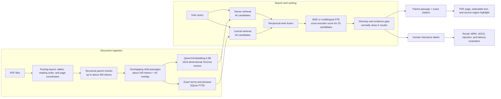

# Reference Desk

[](https://github.com/FKENZOLS/reference-desk/actions/workflows/tests.yml)
[](https://github.com/FKENZOLS/reference-desk/releases/latest)

[](LICENSE)

Reference Desk is a private, local search application for PDF collections. It
finds relevant passages across all your documents and opens the exact page and
highlighted source region.

It is an evidence-first alternative to answer-generation tools: the retrieval
pipeline returns ranked source passages and always preserves a direct route to
the original PDF evidence.

Your PDFs, indexes, bookmarks, and notes stay on your computer. They are not
uploaded to GitHub.

## What it can do

- Search all indexed PDFs at once.
- Combine semantic and exact-term search, then rerank the best passages.
- Open citations on the correct PDF page with selectable text.
- Save passages, notes, bookmarks, and named research collections.
- Compare passages and export selected material to Markdown or Word.
- Add, replace, quarantine, restore, and back up documents from the interface.
- Check corpus health, storage use, duplicates, and document revisions.
- Compare retrieval configurations in a saved evaluation workbench.
- Recover from CUDA reranker failures without restarting the whole app.
- Export a privacy-safe diagnostic ZIP without PDFs, queries, or excerpts.

## Computer requirements

The recommended computer has:

- Windows 10 or Windows 11.
- Python 3.12, 64-bit.
- Ollama.
- An NVIDIA CUDA or AMD ROCm-compatible GPU.
- A current GPU driver.

CPU mode is available, but document processing and reranking will be much
slower. Node.js is not required unless you plan to change the interface.

## Easy Windows installation

You do not need Git, GitHub CLI, or programming experience for this method.

### 1. Install Python and Ollama

Install these two applications before continuing:

1. [Python for Windows](https://www.python.org/downloads/windows/) — choose a
   64-bit Python 3.12 release and enable **Add Python to PATH** during setup.
2. [Ollama for Windows](https://ollama.com/download/windows).

Also install the latest driver for your NVIDIA or AMD GPU.

### 2. Download and extract Reference Desk

[Download the latest Windows ZIP](https://github.com/FKENZOLS/reference-desk/archive/refs/heads/main.zip)

Open the downloaded ZIP and select **Extract all**. Do not run the application
from inside the ZIP.

### 3. Double-click `SETUP.bat`

The setup detects NVIDIA CUDA, AMD ROCm, or CPU mode, creates an isolated
Python environment, installs the correct packages, downloads Qwen3-Embedding
through Ollama, caches the public tokenizer and selectable rerankers from
Hugging Face, and checks the computer. The first installation is several gigabytes and
can take a while.

The window stays open if anything goes wrong, so the error message can be
read. Common solutions are also included in `INSTALL_WINDOWS.txt`.

### 4. Double-click `START.bat`

Reference Desk normally opens automatically. If it does not, visit
[http://127.0.0.1:7860](http://127.0.0.1:7860).

Keep the command window open while using the app. Close it, or press `Ctrl+C`,
to stop Reference Desk. Double-click `START.bat` whenever you want to use it
again.

<details>
<summary>Install with GitHub CLI instead</summary>

Install [Git for Windows](https://git-scm.com/download/win) and
[GitHub CLI](https://cli.github.com/), then open PowerShell:

```powershell
gh auth login --web --git-protocol https
cd "$HOME\Documents"
gh repo clone FKENZOLS/reference-desk
cd reference-desk
powershell -ExecutionPolicy Bypass -File .\scripts\setup.ps1 -Backend auto
powershell -ExecutionPolicy Bypass -File .\start.ps1
```

If automatic detection selects the wrong backend, replace `auto` with `rocm`,
`cuda`, or `cpu`.

</details>

## Add and search documents

1. Open **Documents** in the left navigation.
2. Add one or more PDF files.
3. Select **Apply pending changes**.
4. Wait for indexing to finish.
5. Return to **Search** and search the whole collection.

Open **Filters and search within results** to switch between the BGE and
multilingual GTE rerankers. GTE is loaded and validated by default in an
isolated GPU worker. The first
search after switching can take longer
while the selected model loads. Reference Desk keeps only one reranker loaded
at a time to avoid multiplying GPU memory use. If CUDA inference crashes, the
worker restarts while the web application and your open pages stay available.
The search page reports model loading, worker identity, and device health.
Enable **Show
retrieval diagnostics** to inspect dense, lexical, fusion, reranker, token,
truncation, timing, and adaptive candidate-allocation data for each result.
The default Search interface stays focused on the passages and source actions.
Detailed retrieval diagnostics remain available through the filters panel.

Open the collapsed **Advanced** section at the bottom of the sidebar to reach
**Quality** and **Experiments**. Experiments can import a JSONL benchmark or use complete cases built
from relevance feedback. You can compare GTE and BGE on the same candidate
pool, vary candidate count, reranker weight, and passage mode, then save the
results. Selecting **Use in production** applies that completed experiment's
reranker, candidate count, blend weight, and passage mode to normal searches.
Two-model comparison runs are intentionally not promotable; run the winning
model once by itself to create an unambiguous production configuration.
Imported benchmarks support calibration/test splits, categories, languages,
multiple acceptable passages, and hard negatives. Results include 95%
confidence intervals and subgroup metrics. A saved baseline can block
promotion when nDCG@5 falls by more than the configured regression threshold.
Baselines must contain every selected reranker and the exact same benchmark
version and split.

Large or scanned documents can take longer. The ingestion queue can be paused
between documents, and a failed PDF is moved to quarantine instead of stopping
the rest of the queue. Each PDF now has one explicit lifecycle—uploaded,
pending, processing, indexed, failed, or quarantined—with its indexed hash and
transition history visible from the Documents table.

The bell in the lower-right corner keeps persistent updates for model loading,
indexing, worker restarts, backups, and experiments. **Export diagnostics** on
the Documents page creates a support ZIP containing only sanitized settings,
package/GPU information, aggregate corpus health, migration state, and generic
errors. It excludes document names and paths, PDFs, excerpts, queries, and
feedback text.

## Update to the latest version

If you installed the ZIP, download it again, extract it over the existing
`reference-desk` folder, and allow Windows to replace files with matching
names. The package contains no PDFs or research databases, so your local data
is left in place. Run `SETUP.bat` again after a major update.

This release changes retrieval chunks to preserve table column headers,
section ancestry, and paragraph/list/definition/requirement/equation types.
After upgrading, open **Documents** and choose **Reindex all** once so existing
PDFs receive the new structural metadata. Local state migrations create a
small `pre-v*-migration.bak` snapshot before changing an older schema.

If you installed with Git, open PowerShell in the `reference-desk` folder and
run:

```powershell
git pull --ff-only
powershell -ExecutionPolicy Bypass -File .\scripts\setup.ps1 -Backend auto
```

The setup command reuses packages that are already installed. Start the app
again with `powershell -ExecutionPolicy Bypass -File .\start.ps1`.

## Move your library to another computer

GitHub contains only the application. Your PDFs and research data are separate.

1. In the old installation, open **Documents** and select **Create backup**.
2. Install Reference Desk on the new computer using the instructions above.
3. Open **Documents** on the new computer and restore the backup.

## Troubleshooting

### `python` is not recognized

Install 64-bit Python 3.12 again, enable **Add Python to PATH**, and reopen
PowerShell.

### `gh` or `git` is not recognized

Install Git and GitHub CLI, then close and reopen PowerShell. Confirm the setup
with:

```powershell
git --version
gh --version
```

### PowerShell says script execution is disabled

Use the full commands shown in this README. They run the scripts with
`-ExecutionPolicy Bypass` only for that process and do not permanently change
your Windows policy.

### Ollama is unavailable or Qwen3-Embedding is missing

Start the Ollama application, then run:

```powershell
ollama pull qwen3-embedding:0.6b
```

### AMD ROCm setup fails

Update the AMD driver and confirm that the GPU is supported by AMD's current
PyTorch-on-Windows release. Ollama supporting a GPU through Vulkan does not
automatically mean that PyTorch supports the same GPU through ROCm. CPU mode is
available as a fallback.

### The app reports insufficient GPU memory

Close other GPU-heavy applications and retry. The document manager measures
free VRAM and automatically releases search models before ingestion when both
workloads do not fit at that moment.

### Search pauses while documents are indexing

By default, Reference Desk measures free GPU memory after search models are
loaded. It keeps search available only when that free memory covers Docling's
configured headroom plus a small live-query reserve. It does not rely on a
fixed VRAM size. If memory drops between that check and Docling startup, auto
mode closes the reranker worker, unloads the Ollama embedding model, and retries
the same queue once with search temporarily paused. Set
`RAG_SEARCH_DURING_INGESTION=always` only if you want to override that safety
calculation; `never` restores strictly exclusive indexing.
When concurrent mode is active, search pauses only briefly while a document's
Chroma records, lexical index, and manifest are committed, so a result never
mixes old and new revisions of the same source.

A conversion failure is isolated to its PDF. The document is moved to
quarantine with its error history, and the worker continues with the remaining
queue. Service-level failures that make every document unsafe to process still
stop the job and preserve all pending work.

### Check the installation

```powershell
.\.venv\Scripts\python.exe main.py doctor
```

## Privacy and backups

The following data stays local and is excluded from GitHub:

- Source PDFs.
- Chroma and lexical indexes.
- Notes, bookmarks, search history, and quality labels.
- Quarantine, revisions, logs, and corpus backups.

Use **Create backup** in the Documents page to move or protect this data.

<details>
<summary>Linux installation</summary>

Install Python 3.12, Git, Ollama, and the correct NVIDIA or AMD driver. Then run:

```bash
gh auth login --web --git-protocol https
gh repo clone FKENZOLS/reference-desk
cd reference-desk
bash scripts/setup.sh auto
bash start.sh
```

</details>

## Advanced: architecture and retrieval quality

Reference Desk uses retrieval rather than answer generation. It returns source
passages and keeps a direct route back to the PDF evidence.



### Parent–child retrieval

Docling first reconstructs document structure: headings, paragraphs, lists,
tables, reading order, page numbers, and source coordinates. The chunker then
creates two related representations:

- A **parent chunk** keeps the section context and is what the user reads.
- Smaller overlapping **child passages** are embedded and searched.

Small children make precise matches easier, while the parent prevents an
isolated sentence from losing its heading or surrounding explanation. Every
child stores its parent identity and provenance, so a match can expand back to
the readable passage and exact PDF region.

### Hybrid retrieval and reciprocal-rank fusion

Each query runs through two independent retrieval lanes:

1. **Dense retrieval** sends an instructed search query to
   `qwen3-embedding:0.6b` through Ollama and compares its 1024-dimensional
   vector with child vectors in Chroma. Documents are embedded without a task
   instruction, as recommended for Qwen's asymmetric retrieval format. This
   lane handles paraphrases and related meaning.
2. **Lexical retrieval** uses SQLite FTS5 for exact words, phrases, acronyms,
   identifiers, and numbers.

The two score types are not directly comparable. Reciprocal-rank fusion (RRF)
therefore combines their positions instead of their raw scores:

`RRF(document) = sum of 1 / (60 + rank in each result list)`

A passage found by both lanes rises naturally, while a strong result from only
one lane can still survive. By default, each lane retrieves 40 candidates and
the fused list keeps 20 for reranking.

### Cross-encoder reranking and result diversity

The selectable BGE and multilingual GTE rerankers read the query and each
shortlisted passage together and produce a relevance logit and probability.
This joint judgment is more expensive than vector similarity, so it runs only
after hybrid retrieval has reduced the corpus to 20 candidates. GTE is the
smaller option and uses its official custom Transformers implementation.

The final selector normally shows five results. It limits repeated passages
from the same page or section, then optionally applies a relevance threshold
learned from explicit user labels. The threshold remains inactive until there
are enough relevant and incorrect examples to calibrate it safely.

Reranker calibration is keyed to the complete model and prompt fingerprint.
Changing between BGE and GTE therefore starts a separate score calibration;
old thresholds and judgments cannot silently affect the new model. Select the
model on the **Reference quality** page to inspect or calibrate it independently.

### Model migration and index identity

The Qwen embedding stack uses the new default collection
`technical_docs_qwen_v1`. Its model digest, 1024 dimensions, query instruction,
document format, and tokenizer are included in the ingestion fingerprint. If
any of them changes, Reference Desk refuses to search an incompatible index.
After upgrading from an EmbeddingGemma release, open **Documents** and choose
**Reindex all** once. The legacy Chroma collection is not overwritten, which
makes rollback possible but may temporarily use additional disk space.

### What the quality metrics mean

- **Recall** asks whether a known relevant passage appears anywhere in the
  first `k` results. It reveals whether retrieval found the evidence at all.
- **MRR (Mean Reciprocal Rank)** looks only at the first relevant result. A
  first-place hit scores `1`, second place scores `1/2`, fifth place scores
  `1/5`, and the scores are averaged across queries. Higher MRR means useful
  evidence appears sooner.
- **nDCG** rewards placing all relevant results near the top and can give
  more credit to more-relevant passages. Its logarithmic discount makes a
  relevant result at rank 2 worth more than the same result at rank 10.
- **Rejection accuracy** checks whether the system correctly reports that no
  strong evidence was found for an unanswerable query.
- **Stage recall and latency** show where quality or speed was lost: dense
  retrieval, lexical retrieval, fusion, reranking, or final filtering.

The benchmark format stores expected source pages and passages. User feedback
can be exported into the same format, allowing changes to chunking, candidate
counts, fusion, or reranking to be compared against real reference tasks.
`relevant_targets` groups alternative identifiers such as a chunk ID and its
source page into one acceptable passage, so reindexing does not count the same
answer twice.

GTE requires the model publisher's custom Python architecture. Release defaults
pin the GTE weights, that remote-code repository, and BGE weights to reviewed
immutable Hugging Face commits. Operators may deliberately test other commits
with model-specific variables such as `RAG_GTE_RERANKER_REVISION` and
`RAG_GTE_RERANKER_CODE_REVISION`; do not set either variable to a moving branch
such as `main` on production machines. The legacy unsuffixed variables apply
only to the startup-selected reranker.

<details>
<summary>Developer commands</summary>

```powershell
python main.py serve
python main.py ingest
python main.py evaluate examples/benchmark.example.jsonl
python main.py evaluate examples/benchmark.example.jsonl --reranker both
python main.py evaluate examples/benchmark.example.jsonl --reranker gte --candidate-count 40 --rerank-weight 0.75
python main.py evaluate examples/benchmark.example.jsonl --reranker gte --passage-mode metadata-child-parent
python main.py doctor
python main.py export
python main.py test
cd frontend
npm run typecheck
npm run build
```

`--reranker both` retrieves each benchmark query once and applies BGE and GTE
to cloned identical candidate pools. Evaluation reports fusion recall at 10,
20, 40, and 80 in addition to selected recall, MRR, nDCG, truncation, and
latency. Use a representative held-out benchmark before changing production
candidate counts or blend weights. `--passage-mode` compares child text,
metadata plus child text, parent context, or combined child and parent context
without changing the production input format.

The production React bundle is included in `frontend/dist`. Node.js 20 or newer
is needed only when modifying `frontend/src`. Read
[ARCHITECTURE.md](ARCHITECTURE.md) before reorganizing ingestion, retrieval,
citations, or storage.

</details>

## License

Reference Desk is released under the [MIT License](LICENSE).
